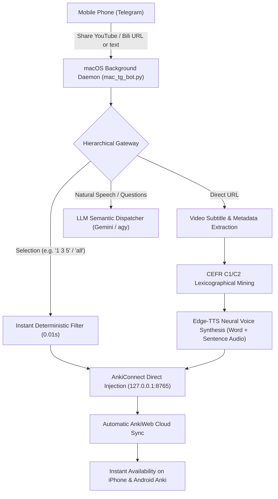

# Anki Video Miner

**The autonomous, mobile-first vocabulary extraction and Anki flashcard engine for macOS.**

Turn any YouTube video, Bilibili lecture, or English text into Apple Books-grade bilingual Anki flashcards via Telegram on your phone. Native audio synthesis, CEFR C1/C2 difficulty calibration, automatic AnkiWeb cloud synchronization, and responsive dark-mode typography.

---

## 1. System Architecture



---

## 2. Core Highlights

- **Mobile Remote Workflow**: Send a video link from Telegram on your phone while commuting. When you arrive home or open Anki, your curated flashcards and native audio are already synced.
- **Zero API Lock-in**: Powered by free Google Gemini API (or local Antigravity `agy` CLI), free Edge-TTS neural speech synthesis, and local AnkiConnect.
- **Cognitive Hygiene & Design Tokens**: 100% boxless, tokenized Apple/Tailwind Slate typography. Automatically adapts between daytime light mode and nighttime pure black OLED dark mode (AAA contrast ratio).
- **CEFR C1/C2 Difficulty Calibration**: Explicitly filters out familiar everyday B1/B2 words and focuses on polysemy (熟词僻义), deceptive idioms (欺骗性习语), phrasal collocations, and argumentative syntactic frames.

---

## 3. Quickstart (5-Minute Setup)

### Step 1: Clone & Install Dependencies

```bash
git clone https://github.com/chase-yuan/anki-video-miner.git
cd anki-video-miner

# 1. Install system tools via Homebrew
brew install ffmpeg yt-dlp

# 2. Install Python dependencies
pip install -r requirements.txt
```

### Step 2: Configure Anki Desktop

1. Open **Anki** on your Mac.
2. In the top menu, go to **Tools -> Add-ons -> Get Add-ons...**
3. Paste code **`2055492159`** to install [AnkiConnect](https://ankiweb.net/shared/info/2055492159).
4. Restart Anki to activate AnkiConnect.

### Step 3: Configure Settings

Copy the example configuration:

```bash
cp config.example.json config.json
```

Edit `config.json` with your credentials:

```json
{
  "telegram": {
    "bot_token": "1234567890:ABCdefGHIjklMNOpqrsTUVwxyz",
    "admin_user_id": 1626499224,
    "proxy_url": ""
  },
  "llm": {
    "provider": "gemini",
    "gemini_api_key": "AIzaSy...",
    "gemini_model": "gemini-2.5-flash",
    "agy_fallback": true
  },
  "anki": {
    "connect_url": "http://127.0.0.1:8765",
    "deck_prefix": "YouTube",
    "model_name": "Cloze",
    "voice": "en-US-ChristopherNeural",
    "auto_sync": true
  }
}
```

> [!TIP]
> - Get a free Telegram Bot Token from [@BotFather](https://t.me/botfather).
> - Get your Telegram User ID from [@userinfobot](https://t.me/userinfobot).
> - Get a free Google Gemini API Key from [Google AI Studio](https://aistudio.google.com/).
> - If you are in mainland China, set `"proxy_url": "http://127.0.0.1:7897"` (matching your local clash/v2ray port).

### Step 4: Run the Environment Doctor

Verify all dependencies, Anki connection, and tokens with one command:

```bash
python3 check_env.py
```

When all items show `[PASS]`, your environment is 100% ready.

### Step 5: Start the Bot

Run in foreground:

```bash
python3 mac_tg_bot.py
```

Or install as a persistent macOS background daemon (starts automatically on boot):

```bash
./install_mac_service.sh install
```

To manage the daemon:
- Check status: `./install_mac_service.sh status`
- Restart: `./install_mac_service.sh restart`
- Uninstall: `./install_mac_service.sh uninstall`

---

## 4. Telegram Usage Commands

| User Message | Action Performed | Response |
| :--- | :--- | :--- |
| `https://youtube.com/watch?v=...` | Extracts video subtitles and runs C1/C2 lexicographical mining | Returns numbered candidates with IPA, POS, and Chinese definition |
| `1 3 5` or `all` or `前3个` | Instantly injects selected items into Anki with audio | Adds Cloze cards and triggers AnkiWeb cloud sync |
| `把讲多巴胺的词存入anki` | Natural language selection via semantic intent agent | Identifies target items and injects directly |
| `再帮我多挖几个地道习语` | Continues mining deeper idiomatic phrases from same video | Returns new non-overlapping candidate batch |
| `刚才视频里讲的核心论据是什么？` | Discusses video transcript directly | Returns concise synthesis based on local transcript cache |
| `/shot` | Captures primary Mac screen | Sends screenshot back to phone |
| `/status` | Reads Mac CPU, memory, and disk health | Returns hardware status summary |
| `/sync` | Triggers manual AnkiWeb sync | Syncs collection to cloud |

---

## 5. Mobile Dark Mode & Typography Specification

Cards generated by Anki Video Miner follow **Aesthetic Principle Zero**:

- **Font Hierarchy**: Native system serif & sans-serif stack (`-apple-system`, `BlinkMacSystemFont`).
- **Contrast Adaptation**: Automatically detects iOS AnkiMobile and Android AnkiDroid dark themes via `@media (prefers-color-scheme: dark)` and `.nightMode` classes.
- **Pill Container**: Examples are isolated in subtle `#27272a` (dark) or `#f8fafc` (light) rounded containers rather than harsh borders or nested boxes.
- **Zero Icons/Emojis**: Priority is communicated strictly through typographic weight and design tokens.

---

## 6. License

This project is licensed under the [MIT License](LICENSE).
