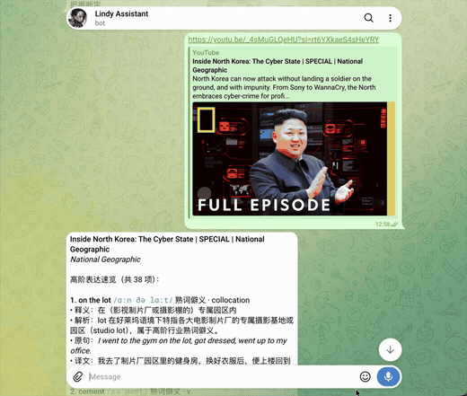
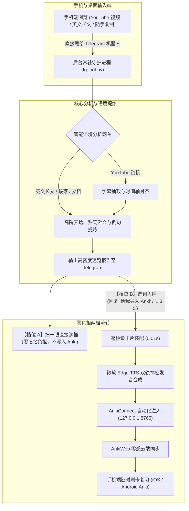
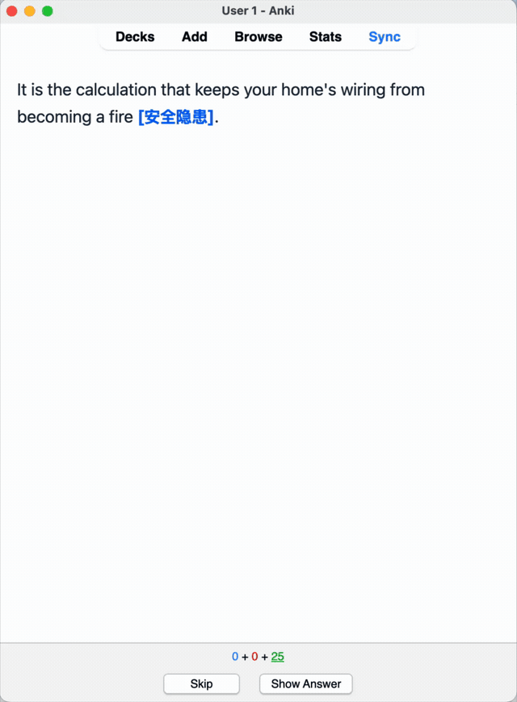

# Anki Context Miner

<p align="center">
  <b>手机端伴读语境生词挖掘与 Anki 极速直刷引擎</b><br>
  <i>看视频、读英文时随手一甩，手机端即看即懂；按需一句话注入 Anki，随时随地高效刷卡。</i>
</p>

<p align="center">
  <a href="README.md"><b>简体中文</b></a> | <a href="README_EN.md">English</a>
</p>

<p align="center">
  <a href="LICENSE"></a>
  
</p>

<p align="center">
  
</p>

---

## 1. 为什么做这个工具？

在手机上看 YouTube 英文演讲、公开课或阅读深度长文时，最常见的痛点是：

1. **查词打断心流**：频繁跳转查词软件，打碎视听与阅读节奏；
2. **生词随查随忘**：查完释义不复习，过几天完全遗忘；
3. **传统制卡极度劝退**：手动在电脑端 Anki 复制粘贴、查音标、下载发音、排版完形填空，耗时繁琐；
4. **背词心理负担沉重**：很多时候我**只想看懂当前内容**，并不想把每一个生词都死记硬背。

**Anki Context Miner** 将全套复杂流程收敛至手机 Telegram 聊天窗口中，提供**两档灵活的零压力学习流**：

- **档位 A · 轻量速览（即看即懂，零心理负担）**：遇到不懂的视频或段落，直接甩给机器人。机器人秒级输出结构化生词速览（音标、词性、熟词僻义、原文语境与译文）。在手机上扫一眼读懂原文即可，无需入库。
- **档位 B · 精准沉淀（按需入库，手机随时刷卡）**：遇到真正想长期掌握的核心表达，随手回复一句 `给我导入 Anki` 或 `1 3 5`。机器人后台自动装配微软 Edge-TTS 原生双轨神经发音完形填空卡片，并自动同步至 AnkiWeb。在通勤路上或闲暇时刻，打开手机端 Anki 即可利用间隔重复算法（SRS）长效记忆。

---

## 2. 系统架构与双轨流转



---

## 3. 核心特性

- **看读随甩，无感伴读（零阻断阅读体验）**：
  在手机上遇到任何生词、疑难长句或整篇视频，无需切换或退出当前应用，直接分享或粘贴至 Telegram 机器人，瞬间返回高阶生词与短语解析。
- **双重记忆弹性：速览扫读 vs 精准入库**：
  - *轻量扫读*：不给大脑施加背单词的心理压力，在手机回复中扫一眼词义与例句即可继续阅读；
  - *按需沉淀*：遇到高价值表达，回复「给我导入 Anki」或序号（如 `1 3 5` / `全部`），自动入库。
- **高保真自动制卡与即时云同步**：
  自动配齐音标、词性、语境例句与微软 Edge-TTS 原生双轨真人神经发音，写入完形填空（Cloze）卡片并秒级同步到 AnkiWeb，手机端 Anki 打开即可直接刷卡。
- **全模态语境输入覆盖**：
  - **视频语境**：支持 YouTube 英文演讲、播客、公开课等视频的字幕提取与逐字稿提炼；
  - **文本语境**：手机端直接转发阅读的长文章段落、学术论文节选，即时提炼高阶表达；
  - **文档语境**：直接向机器人拖拽发送 `.txt` 或 `.md` 文本文件，全自动批量解析并生成待选词表。
- **极简自适应美学排版**：
  卡片排版基于 Apple / Tailwind 设计令牌构建，完全去方框化，自适应夜间纯黑 OLED 暗黑模式（满足 AAA 级对比度）。
- **跨平台完全对齐**：
  原生支持 **macOS**（基于 launchd 的后台无感保活、Retina 屏幕快照、防睡眠）与 **Windows**（基于 VBS 无黑框静默启动、PowerShell 高清截屏、系统执行状态防休眠）。
- **双轨无摩擦部署**：
  - **轨道一（AI 终端智能体）**：终端运行 `codex`、`agy` 或 `claude`，AI 依据规范自动完成环境探测与后台开机自启配置；
  - **轨道二（原生 1 键向导）**：运行 `install.sh`（macOS）或双击 `install.bat`（Windows），秒级完成沙盒虚拟环境初始化与服务注册。
- **2026 新一代大模型矩阵**：
  默认预置最新代际模型（Gemini 3.8 Flash、DeepSeek V4.1-Flash、GPT-6 Luna、Claude Haiku 4.5），支持主流云端 API 与本地已授权 CLI（Codex / agy / claude），零强制 Key 依赖。

---

## 4. 支持的 LLM 引擎矩阵

系统在 `config.json` 或环境变量中支持配置以下服务商。默认采用 `"provider": "auto"` 自动回退策略：优先使用配置的 API Key，若无则自动调用本地已授权的 CLI 终端工具。

| 引擎名称 | 类型 | 配置要求 | 默认与推荐模型 |
| :--- | :--- | :--- | :--- |
| **Google Gemini API** | 云端 REST | 配置 `GEMINI_API_KEY`（可在 Google AI Studio 申请） | `gemini-3.8-flash`（亦兼容 `gemini-3.5-flash-lite` / `gemini-2.5-flash`） |
| **DeepSeek API** | 云端 REST | 配置 `DEEPSEEK_API_KEY`（兼容 OpenAI 规范） | `deepseek-flash`（V4.1-Flash，亦兼容 `deepseek-v4-pro` / `deepseek-chat`） |
| **OpenAI API** | 云端 REST | 配置 `OPENAI_API_KEY` | `gpt-6-luna`（亦兼容 `o4-mini` / `gpt-5.5` / `gpt-4o-mini`） |
| **Anthropic Claude API**| 云端 REST | 配置 `ANTHROPIC_API_KEY` | `claude-haiku-4-5`（亦兼容 `claude-sonnet-5` / `claude-3-5-haiku`） |
| **OpenAI Codex CLI** | 本地 CLI | 执行 `codex login`（无需 API Key） | 本机默认授权配置（如 GPT-6 / Codex 默认模型） |
| **Antigravity CLI (agy)**| 本地 CLI | 安装 Antigravity（无需 API Key） | 当前工作区默认模型（如 Gemini 3.8 / Pro） |
| **Claude Code CLI** | 本地 CLI | 执行 `claude login`（无需 API Key） | 默认 Claude 会话（如 Claude Sonnet 5） |

---

## 5. 快速开始与环境部署

### 必要前置准备（耗时约 3 分钟）

1. **Telegram 机器人凭证**：
   - 在 Telegram 中与 [@BotFather](https://t.me/botfather) 对话，发送 `/newbot` 获取 **Bot Token**；
   - 在 Telegram 中与 [@userinfobot](https://t.me/userinfobot) 对话，获取自己的纯数字 **User ID**（用于防止他人越权使用）。
2. **Anki 桌面端配置**：
   - 打开电脑上的 Anki 桌面端 $\to$ 点击菜单栏 **工具 $\to$ 附加组件 $\to$ 获取附加组件**；
   - 输入安装代码 `2055492159`（安装官方 **AnkiConnect** 插件）；
   - 在 Anki 首选项中登录您的 AnkiWeb 账号，首次配置时保持 Anki 打开。

---

### 部署方式 A：AI 智能体全自主托管部署（推荐）

如果您平时使用终端 AI 助手（**Google Antigravity**、**OpenAI Codex** 或 **Claude Code**），进入克隆目录执行对应命令即可：

```bash
git clone https://github.com/chase-yuan/anki-context-miner.git
cd anki-context-miner

# 使用 Google Antigravity：
agy run AI_SETUP_PROMPT.md

# 使用 OpenAI Codex：
codex exec "根据 AI_SETUP_PROMPT.md 帮我配置并部署本仓库"

# 使用 Anthropic Claude Code：
claude -p "Please configure and deploy this repo according to AI_SETUP_PROMPT.md"
```

AI 智能体将严格执行 [AI_SETUP_PROMPT.md](AI_SETUP_PROMPT.md) 状态机：诊断物理环境、初始化隔离沙盒 `.venv`、询问必要凭证一次、运行物理探针并注册开机自启守护服务。

---

### 部署方式 B：原生 1 键交互向导部署

如果您不使用 AI 命令行，可直接运行系统配套脚本：

#### macOS / Linux：
```bash
git clone https://github.com/chase-yuan/anki-context-miner.git
cd anki-context-miner
./install.sh
```

#### Windows：
```cmd
git clone https://github.com/chase-yuan/anki-context-miner.git
cd anki-context-miner
install.bat
```

向导将自动完成：
1. 创建独立的 `.venv` 虚拟环境，确保不影响系统全局 Python 环境；
2. 安装 `requirements.txt` 所需的全部依赖；
3. 交互式录入 Token 与 API Key，运行网络与 AnkiConnect 连通性测试；
4. 询问并自动注册开机静默启动守护服务。

---

## 6. 后台守护服务管理

系统支持全天候静默后台运行：

### macOS (`launchd`)
- **状态检查**：`python3 setup_wizard.py --check-only`
- **重新注册服务**：`python3 setup_wizard.py --install-service`
- **运行日志**：仓库目录下的 `bot.log` 与 `bot_err.log`

### Windows (启动目录 VBS + 任务调度)
- **开机自动运行**：安装器自动将 `anki_video_miner_hidden.vbs` 注册至 Windows 启动目录（`shell:startup`），开机静默常驻，**无任何黑框弹出**；
- **手动启动**：直接双击项目根目录下的 `run_bot.bat`。

---

## 7. Telegram 移动端交互指令全景表

| 发送内容 | 执行动作 | 机器人回复 |
| :--- | :--- | :--- |
| `https://youtube.com/watch?v=...` | 自动抓取字幕并执行高阶生词与短语提炼 | 返回带音标、词性、中文释义的待选词汇表 |
| 英文长段落（或 `文本: [内容]`） | 自动分析句子与段落，提炼 C1/C2 词汇与搭配 | 暂存待选词条，生成预览序号 |
| 拖拽上传 `.txt` 或 `.md` 文件 | 全文文本解析与高阶词汇萃取 | 关联文件名生成候选生词库 |
| **无需发送任何操作** | 手机端直接扫一眼生词解析 | 即看即懂，零心理压力，不写入 Anki |
| `给我导入 Anki` 或 `all` 或 `1 3 5` | 选定词汇一键注入本地 Anki（含神经发音） | 写入完形填空卡片并触发云端即时同步 |
| `把讲多巴胺的词存入 anki` | 语义意图理解与目标词汇筛选 | 自动识别匹配项并直接注入 Anki |
| `再帮我多挖几个地道习语` | 针对当前文本/视频进行二次深度挖掘 | 返回新一轮不重复的短语搭配表 |
| `刚才内容里讲的核心论据是什么？` | 基于上下文缓存进行互动答疑 | 给出精准的技术提炼或论据总结 |
| `/shot` | 拍摄当前 Mac / Windows 物理桌面屏幕 | 将高清截图即时回传到手机端 |
| `/status` | 读取宿主机 CPU、内存与磁盘占用 | 返回硬件运行状态摘要 |
| `/sync` | 手动触发 AnkiWeb 云端同步指令 | 同步本地卡包至 AnkiWeb 服务器 |

---

## 8. 卡片排版与视觉规范

生成的卡片严格遵循极简美学规范：

- **字体梯度**：采用原生系统无衬线与衬线字体栈（`-apple-system`, `BlinkMacSystemFont`, `Segoe UI`）；
- **深浅自适应**：通过 `@media (prefers-color-scheme: dark)` 与 `.nightMode` 原生自适应 iOS AnkiMobile 与 Android AnkiDroid 的纯黑暗黑主题；
- **胶囊化容器**：例句与发音区域置于浅灰 `#f8fafc` 或深灰 `#27272a` 的微圆角区域内，摒弃粗暴的高饱和度线条与嵌套方框；
- **零冗余装饰**：杜绝装饰性 Emoji 堆砌，完全依托字阶、字重与留白构建清晰认知层级。

<p align="center">
  
  <br>
  <em>真机刷卡交互演示（空格键展开释义、例句与神经发音）</em>
</p>

<p align="center">
  
</p>

---

## 9. 开源协议

本项目基于 [MIT License](LICENSE) 协议完全开源。
