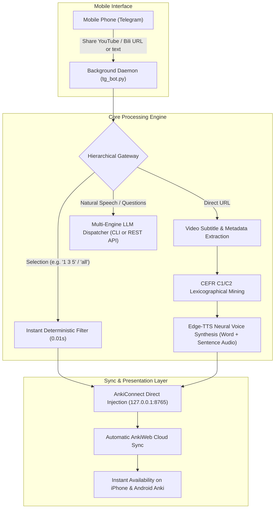

# Anki Video Miner

**The autonomous, mobile-first vocabulary extraction and Anki flashcard engine for macOS & Windows.**

Turn any YouTube video, Bilibili lecture, or English text into Apple Books-grade bilingual Anki flashcards via Telegram on your phone. Native audio synthesis, CEFR C1/C2 difficulty calibration, automatic AnkiWeb cloud synchronization, and responsive dark-mode typography.

[](docs/adr/0001-cross-platform-ai-deployment-architecture.md)
[](LICENSE)
[](#)

---

## 1. System Architecture



---

## 2. Core Highlights

- **Mobile Remote Workflow**: Send a video link from Telegram on your phone while commuting. When you arrive home or open Anki, your curated flashcards and native audio are already synced.
- **Cross-Platform Parity**: Full native support for **macOS** (launchd daemon, Retina screenshot, caffeinate anti-sleep) and **Windows** (invisible background VBS runner, PowerShell screenshot, Windows sleep prevention API).
- **Dual-Track Zero-Friction Setup**:
  - **Track 1 (AI Agent CLI)**: Log into your AI terminal (`codex`, `agy`, `claude`) and let the AI automatically inspect, configure, and mount the daemon with zero manual guesswork.
  - **Track 2 (Native 1-Click)**: Run `install.sh` (macOS) or `install.bat` (Windows) for instant isolated `.venv` bootstrap.
- **Universal LLM Flexibility**: Choose between direct cloud REST APIs (Google Gemini, DeepSeek, OpenAI, Anthropic Claude) or local logged-in CLI agents (OpenAI Codex, Google Antigravity, Claude Code) with zero API keys required.
- **Cognitive Hygiene & Design Tokens**: 100% boxless, tokenized Apple/Tailwind Slate typography. Automatically adapts between daytime light mode and nighttime pure black OLED dark mode (AAA contrast ratio).
- **CEFR C1/C2 Calibration**: Explicitly filters out familiar everyday B1/B2 words and focuses on polysemy, deceptive idioms, phrasal collocations, and argumentative syntactic frames.

---

## 3. Supported LLM Engines

You can configure any of the following providers in `config.json` or through environment variables. By default (`"provider": "auto"`), the system checks your active API keys first, and automatically falls back to your local logged-in CLI tools.

| Provider | Type | Setup Requirements | Default Model |
| :--- | :--- | :--- | :--- |
| **Google Gemini API** | Cloud REST | Set `GEMINI_API_KEY` (Free at Google AI Studio) | `gemini-2.5-flash` |
| **DeepSeek API** | Cloud REST | Set `DEEPSEEK_API_KEY` (`https://api.deepseek.com/v1`) | `deepseek-chat` |
| **OpenAI API** | Cloud REST | Set `OPENAI_API_KEY` | `gpt-4o-mini` |
| **Claude API** | Cloud REST | Set `ANTHROPIC_API_KEY` | `claude-3-5-haiku-20241022` |
| **OpenAI Codex CLI** | Local CLI | Run `codex login` (No API key needed) | User default profile |
| **Antigravity CLI (agy)** | Local CLI | Installed via Antigravity (No API key needed) | Default workspace model |
| **Claude Code CLI** | Local CLI | Run `claude login` (No API key needed) | Default Claude session |

---

## 4. Quickstart & Deployment

### Essential Prerequisites (Human Action Required)

1. **Telegram Credentials**:
   - Get your Bot Token from [@BotFather](https://t.me/botfather).
   - Get your numeric User ID from [@userinfobot](https://t.me/userinfobot).
2. **Anki Desktop Setup**:
   - Open Anki Desktop -> **Tools -> Add-ons -> Get Add-ons...**
   - Install **AnkiConnect** (code: `2055492159`).
   - Keep Anki running during initial setup.

---

### Track 1: AI Agent Autonomous Deployment (Recommended)

If you use an AI terminal assistant (**Codex CLI**, **Google Antigravity**, or **Claude Code**), open your terminal in the cloned directory and run:

```bash
git clone https://github.com/chase-yuan/anki-video-miner.git
cd anki-video-miner

# With Google Antigravity:
agy run AI_SETUP_PROMPT.md

# Or with OpenAI Codex:
codex exec "根据 AI_SETUP_PROMPT.md 帮我配置并部署本仓库"

# Or with Anthropic Claude Code:
claude -p "Please configure and deploy this repo according to AI_SETUP_PROMPT.md"
```

The AI Agent will strictly follow the [AI_SETUP_PROMPT.md](AI_SETUP_PROMPT.md) state machine: diagnose your environment, create a sandboxed virtual environment, ask for your essential credentials once, run physical probe tests, and register the auto-start background service using verified templates.

---

### Track 2: Native 1-Click Installer

If you prefer a direct script without an AI CLI:

#### On macOS / Linux:
```bash
git clone https://github.com/chase-yuan/anki-video-miner.git
cd anki-video-miner
./install.sh
```

#### On Windows:
```cmd
git clone https://github.com/chase-yuan/anki-video-miner.git
cd anki-video-miner
install.bat
```

The installer will:
1. Create an isolated `.venv` virtual environment (leaving your global system Python untouched).
2. Install all dependencies from `requirements.txt`.
3. Launch the interactive `setup_wizard.py` to verify AnkiConnect, test Telegram bot tokens, and install the background service.

---

## 5. Background Service Management

The system runs completely silently in the background:

### macOS (`launchd`)
- **Status check**: `python3 setup_wizard.py --check-only`
- **Manual install**: `python3 setup_wizard.py --install-service`
- **Logs**: `bot.log` and `bot_err.log` inside the repository directory.

### Windows (Startup VBS + Task Scheduler)
- **Automatic run**: The installer registers `anki_video_miner_hidden.vbs` in your Windows Startup folder (`shell:startup`). It launches on login with **zero black console window**.
- **Manual run**: Double-click `run_bot.bat`.

---

## 6. Telegram Usage Commands

| User Message | Action Performed | Response |
| :--- | :--- | :--- |
| `https://youtube.com/watch?v=...` | Extracts video subtitles and runs C1/C2 lexicographical mining | Returns numbered candidates with IPA, POS, and Chinese definition |
| `https://bilibili.com/video/BV...` | Extracts Bilibili subtitles/audio and generates study monograph | Returns lecture notes and saves to Obsidian |
| `When considering the evolution...` (or `文本: [内容]`) | Mines C1/C2 vocabulary directly from text or article paragraph | Stages numbered candidates for Anki selection |
| Drag & drop `.txt` or `.md` file | Parses text document and extracts high-register vocabulary | Stages candidates with document title metadata |
| `1 3 5` or `all` or `前3个` | Instantly injects selected items into Anki with audio | Adds Cloze cards and triggers AnkiWeb cloud sync |
| `把讲多巴胺的词存入anki` | Natural language selection via semantic intent agent | Identifies target items and injects directly |
| `再帮我多挖几个地道习语` | Continues mining deeper idiomatic phrases from same source | Returns new non-overlapping candidate batch |
| `刚才内容里讲的核心论据是什么？` | Discusses transcript/article directly | Returns concise synthesis based on local content cache |
| `/shot` | Captures primary Mac / Windows screen | Sends screenshot back to phone |
| `/status` | Reads CPU, memory, and disk health | Returns hardware status summary |
| `/sync` | Triggers manual AnkiWeb sync | Syncs collection to cloud |

---

## 7. Mobile Dark Mode & Typography Specification

Cards generated by Anki Video Miner follow **Aesthetic Principle Zero**:

- **Font Hierarchy**: Native system serif & sans-serif stack (`-apple-system`, `BlinkMacSystemFont`, `Segoe UI`).
- **Contrast Adaptation**: Automatically detects iOS AnkiMobile and Android AnkiDroid dark themes via `@media (prefers-color-scheme: dark)` and `.nightMode` classes.
- **Pill Container**: Examples are isolated in subtle `#27272a` (dark) or `#f8fafc` (light) rounded containers rather than harsh borders or nested boxes.
- **Zero Icons/Emojis**: Priority is communicated strictly through typographic weight and design tokens.

---

## 8. Architecture Decisions & Methodology

This project's engineering architecture follows Li Xiaolai's software methodology:
- **[ADR 0001: Cross-Platform AI-Driven Deployment Architecture](docs/adr/0001-cross-platform-ai-deployment-architecture.md)**: Formal record of the essential vs accidental complexity boundary, strict templating invariants, and dual-track onboarding design.

---

## 9. License

This project is licensed under the [MIT License](LICENSE).
