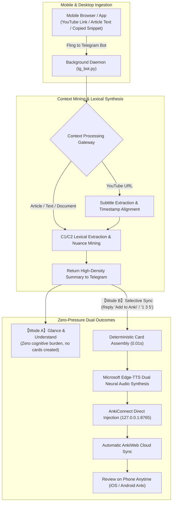

# Anki Context Miner

<p align="center">
  <b>Mobile-First Context Vocabulary Miner & Direct Anki Flashcard Sync Engine</b><br>
  <i>Fling YouTube videos or English texts from your phone to Telegram. Glance for zero-pressure comprehension, or inject into Anki with a single phrase for spaced repetition anytime, anywhere.</i>
</p>

<p align="center">
  <a href="README.md">简体中文</a> | <a href="README_EN.md"><b>English</b></a>
</p>

<p align="center">
  <a href="LICENSE"></a>
  
</p>

<p align="center">
  
</p>

---

## 1. Why Anki Context Miner?

When watching YouTube lectures, podcasts, or reading in-depth articles on your phone, you face four unavoidable frictions:

1. **Broken Reading Flow**: Constantly jumping back and forth to dictionary apps shatters your immersion;
2. **Fleeting Recall**: Looking up definitions without review means forgetting them within days;
3. **Painful Card Creation**: Manually copying sentences on desktop Anki, hunting for phonetic IPA, downloading audio clips, and formatting cloze deletions is tedious and exhausting;
4. **Cognitive Overload**: Most of the time, **you just want to understand the current content**, without feeling obligated to memorize every single unknown word.

**Anki Context Miner** collapses this entire engineering chain into your Telegram chat window on your phone, offering **two flexible, zero-pressure modes**:

- **Mode A · Zero-Pressure Glance (Instant Comprehension)**: When encountering an unfamiliar video or dense passage, simply fling the link or text to the Telegram bot. The bot instantly returns a high-signal lexical breakdown (phonetics, parts of speech, nuanced meanings, original sentence, and translation). Glance through it directly on your phone to grasp the material — zero obligation to memorize.
- **Mode B · Selective Long-Term Immersion (One-Phrase Sync to Anki)**: When you spot high-value expressions or idioms you truly want to retain, simply reply `Add to Anki` or `1 3 5`. The bot automatically generates Cloze flashcards with native Microsoft Edge-TTS neural audio and syncs them to AnkiWeb. On your commute or during breaks, open Anki on your phone (iOS / Android) to review with spaced repetition (SRS).

---

## 2. Architecture & Dual-Track Workflow



---

## 3. Core Highlights

- **Seamless Mobile Companion (Zero Interruption)**:
  Encounter unknown vocabulary or challenging arguments while watching videos or reading articles on your phone. Share or paste directly to Telegram without closing your app.
- **Dual Learning Elasticity: Quick Glance vs. Selective Card Creation**:
  - *Lightweight Scan*: Read through vocabulary meanings and sentence breakdowns directly in the bot's response without the pressure of forced memorization;
  - *Selective Sync*: For expressions you genuinely want to master, reply with "Add to Anki" or specific indices (`1 3 5` / `all`) to inject them into Anki.
- **High-Fidelity Automated Cards & Cloud Sync**:
  Each card includes IPA phonetics, parts of speech, in-context example sentences, and dual-track Microsoft Edge-TTS neural pronunciation (isolated word + full sentence). Cards sync automatically to AnkiWeb for instant mobile review.
- **Multimodal Context Ingestion**:
  - **Video Stream**: Subtitle and verbatim extraction for YouTube lectures, podcasts, and documentaries;
  - **Text Stream**: Direct forwarding of article excerpts, papers, and essays for instant lexical analysis;
  - **Document Stream**: Drag-and-drop `.txt` or `.md` files to automatically parse and extract high-register terms.
- **Minimalist Adaptive Typography**:
  Built on Apple and Tailwind design tokens without nested borders or visual clutter. Automatically adapts to pure-black OLED dark mode with AAA contrast on AnkiMobile and AnkiDroid.
- **Full Cross-Platform Parity**:
  Native background support for **macOS** (`launchd` daemon, Retina screen capture, anti-sleep) and **Windows** (invisible background VBS runner, PowerShell high-DPI screenshot, system execution state anti-sleep).
- **Dual-Track Zero-Friction Setup**:
  - **Track 1 (AI Agent CLI)**: Log into your AI terminal (`codex`, `agy`, or `claude`), and the agent autonomously inspects your environment and installs the background service;
  - **Track 2 (Native 1-Click)**: Run `./install.sh` (macOS/Linux) or double-click `install.bat` (Windows) for isolated virtual environment setup and step-by-step guidance.
- **Modern 2026 Frontier LLM Matrix**:
  Preconfigured with current generation models (Gemini 3.8 Flash, DeepSeek V4.1-Flash, GPT-6 Luna, Claude Haiku 4.5). Supports cloud REST APIs as well as locally authenticated CLI tools (Codex, agy, Claude Code) with zero mandatory API keys.

---

## 4. Supported LLM Engines

You can configure any of the following providers in `config.json` or through environment variables. The default strategy (`"provider": "auto"`) checks configured API keys first, then automatically falls back to your locally authenticated CLI tools.

| Engine | Type | Requirements | Default & Recommended Models |
| :--- | :--- | :--- | :--- |
| **Google Gemini API** | Cloud REST | Set `GEMINI_API_KEY` (Google AI Studio) | `gemini-3.8-flash` (also supports `gemini-3.5-flash-lite` / `gemini-2.5-flash`) |
| **DeepSeek API** | Cloud REST | Set `DEEPSEEK_API_KEY` (OpenAI-compatible) | `deepseek-flash` (V4.1-Flash, also supports `deepseek-v4-pro` / `deepseek-chat`) |
| **OpenAI API** | Cloud REST | Set `OPENAI_API_KEY` | `gpt-6-luna` (also supports `o4-mini` / `gpt-5.5` / `gpt-4o-mini`) |
| **Anthropic Claude API**| Cloud REST | Set `ANTHROPIC_API_KEY` | `claude-haiku-4-5` (also supports `claude-sonnet-5` / `claude-3-5-haiku`) |
| **OpenAI Codex CLI** | Local CLI | Run `codex login` (No API key needed) | Default environment profile (e.g. GPT-6 / Codex default) |
| **Antigravity CLI (agy)**| Local CLI | Installed via Antigravity (No API key needed) | Default workspace model (e.g. Gemini 3.8 / Pro) |
| **Claude Code CLI** | Local CLI | Run `claude login` (No API key needed) | Default Claude session (e.g. Claude Sonnet 5) |

---

## 5. Quick Start & Setup

### Prerequisites (~3 minutes)

1. **Telegram Bot Credentials**:
   - Message [@BotFather](https://t.me/botfather) on Telegram and send `/newbot` to get your **Bot Token**;
   - Message [@userinfobot](https://t.me/userinfobot) on Telegram to get your numeric **User ID** (prevents unauthorized access).
2. **Anki Desktop Configuration**:
   - Open Anki on your computer $\to$ Menu: **Tools $\to$ Add-ons $\to$ Get Add-ons...**;
   - Enter code `2055492159` to install **AnkiConnect**;
   - Log into your AnkiWeb account under Anki Preferences, and keep Anki running during initial setup.

---

### Deployment Track A: Fully Autonomous AI Setup (Recommended)

If you use a terminal AI assistant (**Google Antigravity**, **OpenAI Codex**, or **Claude Code**), run the matching command in the cloned directory:

```bash
git clone https://github.com/chase-yuan/anki-context-miner.git
cd anki-context-miner

# Using Google Antigravity:
agy run AI_SETUP_PROMPT.md

# Using OpenAI Codex:
codex exec "Deploy and configure this repository per AI_SETUP_PROMPT.md"

# Using Anthropic Claude Code:
claude -p "Please configure and deploy this repo according to AI_SETUP_PROMPT.md"
```

The AI agent will strictly follow the [AI_SETUP_PROMPT.md](AI_SETUP_PROMPT.md) state machine: diagnose your environment, create an isolated virtual environment (`.venv`), ask for your essential credentials once, run physical probe tests, and register the auto-start background service.

---

### Deployment Track B: Native 1-Click Interactive Wizard

If you prefer native shell scripts:

#### macOS / Linux:
```bash
git clone https://github.com/chase-yuan/anki-context-miner.git
cd anki-context-miner
./install.sh
```

#### Windows:
```cmd
git clone https://github.com/chase-yuan/anki-context-miner.git
cd anki-context-miner
install.bat
```

The installer will automatically:
1. Create an isolated `.venv` environment to protect your global Python environment;
2. Install all required dependencies from `requirements.txt`;
3. Interactively record your tokens and verify connectivity with AnkiConnect;
4. Register the background auto-start daemon.

---

## 6. Background Service Management

The system runs silently 24/7 in the background:

### macOS (`launchd`)
- **Status check**: `python3 setup_wizard.py --check-only`
- **Reinstall service**: `python3 setup_wizard.py --install-service`
- **Logs**: `bot.log` and `bot_err.log` in repository root

### Windows (Startup VBS + Task Scheduler)
- **Auto-start**: Registered in `shell:startup` via `anki_video_miner_hidden.vbs` without pop-up black terminal windows;
- **Manual start**: Double-click `run_bot.bat` in the repository root.

---

## 7. Telegram Command Reference

| Message Sent | Action Performed | Bot Response |
| :--- | :--- | :--- |
| `https://youtube.com/watch?v=...` | Extracts video subtitles and runs lexical mining | Returns numbered candidates with IPA, POS, and definitions |
| English text paragraph (or `text: [content]`) | Mines C1/C2 vocabulary directly from text or article paragraph | Stages numbered candidates for Anki selection |
| Drag & drop `.txt` or `.md` file | Parses text document and extracts high-register vocabulary | Stages candidates with document title metadata |
| **No action needed** | Glance through the bot's vocabulary breakdown | Immediate comprehension with zero obligation to create cards |
| `Add to Anki` or `all` or `1 3 5` | Instantly injects selected items into Anki with neural audio | Adds Cloze cards and triggers AnkiWeb cloud sync |
| `Save the words about dopamine` | Natural language selection via semantic intent agent | Identifies target items and injects directly |
| `Mine more idiomatic phrases` | Continues mining deeper idiomatic phrases from same source | Returns new non-overlapping candidate batch |
| `What was the core argument?` | Discusses transcript/article directly | Returns concise synthesis based on local content cache |
| `/shot` | Captures primary Mac / Windows screen | Sends screenshot back to phone |
| `/status` | Reads CPU, memory, and disk health | Returns hardware status summary |
| `/sync` | Triggers manual AnkiWeb sync | Syncs collection to cloud |

---

## 8. Card Styling & Visual Specifications

Cards generated by Anki Context Miner follow minimalist aesthetic principles:

- **Font Hierarchy**: Native system serif & sans-serif stack (`-apple-system`, `BlinkMacSystemFont`, `Segoe UI`).
- **Contrast Adaptation**: Automatically detects iOS AnkiMobile and Android AnkiDroid dark themes via `@media (prefers-color-scheme: dark)` and `.nightMode` classes.
- **Pill Container**: Context examples and audio buttons are isolated in subtle `#f8fafc` (light) or `#27272a` (dark) rounded pill containers rather than harsh borders or nested boxes.
- **Zero Decorative Clutter**: Eliminates decorative emojis and icons, relying strictly on typographic scale, weight, and whitespace.

<p align="center">
  
  <br>
  <em>Live Flashcard Review Demo (Spacebar reveal, audio trigger, and responsive dark mode)</em>
</p>

<p align="center">
  
</p>

---

## 9. License

This project is licensed under the [MIT License](LICENSE).
