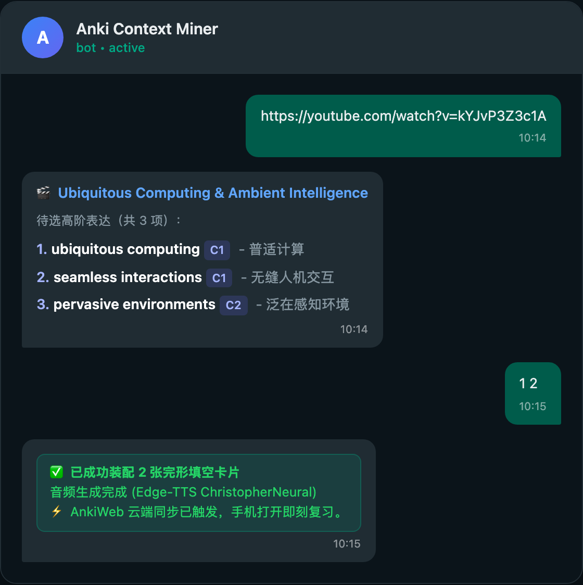
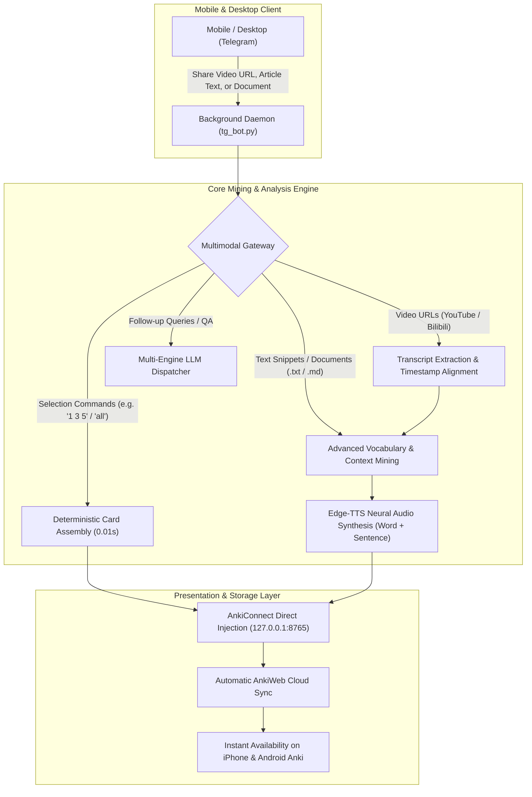
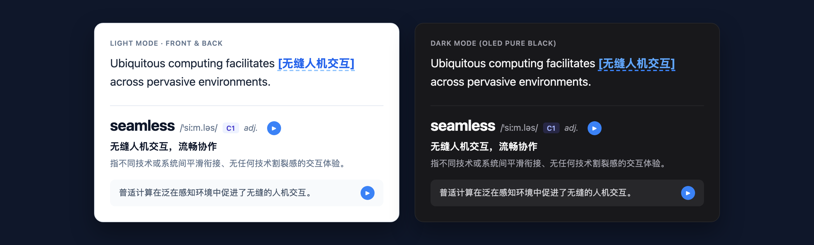

# Anki Context Miner

<p align="center">
  <b>Autonomous, Multimodal Context-Driven Vocabulary & Flashcard Engine for macOS & Windows</b><br>
  <i>Extract advanced vocabulary, idiomatic collocations, and native neural audio from videos, articles, and documents via Telegram on your phone. Direct injection into Anki with instant AnkiWeb cloud sync.</i>
</p>

<p align="center">
  <a href="README_EN.md"><b>English</b></a> | <a href="README.md">简体中文</a>
</p>

<p align="center">
  <a href="docs/adr/0001-cross-platform-ai-deployment-architecture.md"></a>
  <a href="LICENSE"></a>
  
</p>

<p align="center">
  
</p>

---

## 1. System Architecture



---

## 2. Core Highlights

- **Mobile-First Remote Workflow**: Send a video link or article excerpt from Telegram on your phone while commuting. When you open Anki on your phone or desktop, your flashcards and native audio are already synced.
- **Multimodal Context Ingestion**:
  - **Video Stream**: Subtitle and verbatim extraction for YouTube and Bilibili videos;
  - **Text Stream**: Direct forwarding of article excerpts, papers, and essays for instant lexical analysis;
  - **Document Stream**: Drag-and-drop `.txt` or `.md` files to automatically parse and extract high-register terms.
- **Full Cross-Platform Parity**: Native background support for **macOS** (`launchd` daemon, Retina screen capture, caffeinate anti-sleep) and **Windows** (invisible background VBS runner, PowerShell high-DPI screenshot, Windows execution state anti-sleep).
- **Dual-Track Zero-Friction Setup**:
  - **Track 1 (AI Agent CLI)**: Log into your AI terminal (`codex`, `agy`, or `claude`), and the agent autonomously inspects your environment and installs the background service.
  - **Track 2 (Native 1-Click)**: Run `./install.sh` (macOS/Linux) or double-click `install.bat` (Windows) for isolated virtual environment setup and step-by-step guidance.
- **Universal LLM Flexibility**: Choose between major cloud REST APIs (Google Gemini, DeepSeek, OpenAI, Anthropic Claude) or local logged-in CLI agents (OpenAI Codex, Google Antigravity, Claude Code) with zero API keys required.
- **Clean Responsive Typography**: Elegant, boxless design using native system font stacks. Automatically adapts between daylight clean mode and pure-black OLED dark mode with AAA contrast.
- **Intelligent Vocabulary Calibration**: Filters out familiar everyday words and focuses on high-register expressions, deceptive idioms, phrasal collocations, and argumentative structures.

---

## 3. Supported LLM Engines

You can configure any of the following providers in `config.json` or through environment variables. The default strategy (`"provider": "auto"`) checks configured API keys first, then automatically falls back to your locally authenticated CLI tools.

| Engine | Type | Requirements | Default Model |
| :--- | :--- | :--- | :--- |
| **Google Gemini API** | Cloud REST | Set `GEMINI_API_KEY` (Free at Google AI Studio) | `gemini-2.5-flash` |
| **DeepSeek API** | Cloud REST | Set `DEEPSEEK_API_KEY` (OpenAI-compatible) | `deepseek-chat` |
| **OpenAI API** | Cloud REST | Set `OPENAI_API_KEY` | `gpt-4o-mini` |
| **Anthropic Claude API**| Cloud REST | Set `ANTHROPIC_API_KEY` | `claude-3-5-haiku-20241022` |
| **OpenAI Codex CLI** | Local CLI | Run `codex login` (No API key needed) | Default user profile |
| **Antigravity CLI (agy)**| Local CLI | Installed via Antigravity (No API key needed) | Default workspace model |
| **Claude Code CLI** | Local CLI | Run `claude login` (No API key needed) | Default Claude session |

---

## 4. Quickstart & Deployment

### Prerequisites (Approx. 3 Minutes)

1. **Telegram Bot Credentials**:
   - Talk to [@BotFather](https://t.me/botfather) on Telegram and send `/newbot` to get your **Bot Token**.
   - Talk to [@userinfobot](https://t.me/userinfobot) on Telegram to get your numeric **User ID** (prevents unauthorized access).
2. **Anki Desktop Setup**:
   - Open Anki Desktop -> **Tools -> Add-ons -> Get Add-ons...**
   - Install **AnkiConnect** (code: `2055492159`).
   - Log into your free AnkiWeb account in Anki preferences and keep Anki running during initial setup.

---

### Track A: Autonomous AI Agent Deployment (Recommended)

If you use an AI terminal assistant (**Google Antigravity**, **OpenAI Codex**, or **Claude Code**), run the following in your terminal:

```bash
git clone https://github.com/chase-yuan/anki-context-miner.git
cd anki-context-miner

# With Google Antigravity:
agy run AI_SETUP_PROMPT.md

# With OpenAI Codex:
codex exec "Deploy and configure this repository per AI_SETUP_PROMPT.md"

# With Anthropic Claude Code:
claude -p "Please configure and deploy this repo according to AI_SETUP_PROMPT.md"
```

The AI agent will strictly follow the [AI_SETUP_PROMPT.md](AI_SETUP_PROMPT.md) state machine: diagnose your environment, create an isolated virtual environment (`.venv`), ask for your essential credentials once, run physical probe tests, and register the auto-start background service.

---

### Track B: Native 1-Click Interactive Wizard

If you prefer a direct script without an AI CLI:

#### On macOS / Linux:
```bash
git clone https://github.com/chase-yuan/anki-context-miner.git
cd anki-context-miner
./install.sh
```

#### On Windows:
```cmd
git clone https://github.com/chase-yuan/anki-context-miner.git
cd anki-context-miner
install.bat
```

The wizard will:
1. Create an isolated `.venv` virtual environment (leaving your global system Python untouched).
2. Install all required dependencies from `requirements.txt`.
3. Interactively verify your Telegram credentials and API key with live network and AnkiConnect tests.
4. Offer to register the auto-start background daemon.

---

## 5. Background Service Management

The system runs completely silently in the background:

### macOS (`launchd`)
- **Status check**: `python3 setup_wizard.py --check-only`
- **Manual install**: `python3 setup_wizard.py --install-service`
- **Logs**: `bot.log` and `bot_err.log` inside the repository directory.

### Windows (Startup VBS + Task Scheduler)
- **Automatic run**: The installer registers `anki_video_miner_hidden.vbs` in your Windows Startup folder (`shell:startup`). It launches on login with **zero black console window**.
- **Manual run**: Double-click `run_bot.bat` in the repository directory.

---

## 6. Telegram Command Reference

| User Message | Action Performed | Response |
| :--- | :--- | :--- |
| `https://youtube.com/watch?v=...` | Extracts video subtitles and runs lexical mining | Returns numbered candidates with IPA, POS, and definitions |
| `https://bilibili.com/video/BV...` | Extracts subtitles/audio and generates study notes | Returns structured lecture notes and saves to local vault |
| English text paragraph (or `text: [content]`) | Mines C1/C2 vocabulary directly from text or article paragraph | Stages numbered candidates for Anki selection |
| Drag & drop `.txt` or `.md` file | Parses text document and extracts high-register vocabulary | Stages candidates with document title metadata |
| `1 3 5` or `all` or `top 3` | Instantly injects selected items into Anki with audio | Adds Cloze cards and triggers AnkiWeb cloud sync |
| `Save the words about dopamine` | Natural language selection via semantic intent agent | Identifies target items and injects directly |
| `Mine more idiomatic phrases` | Continues mining deeper idiomatic phrases from same source | Returns new non-overlapping candidate batch |
| `What was the core argument?` | Discusses transcript/article directly | Returns concise synthesis based on local content cache |
| `/shot` | Captures primary Mac / Windows screen | Sends screenshot back to phone |
| `/status` | Reads CPU, memory, and disk health | Returns hardware status summary |
| `/sync` | Triggers manual AnkiWeb sync | Syncs collection to cloud |

---

## 7. Card Styling & Visual Specifications

Cards generated by Anki Context Miner follow minimalist aesthetic principles:

- **Font Hierarchy**: Native system serif & sans-serif stack (`-apple-system`, `BlinkMacSystemFont`, `Segoe UI`).
- **Contrast Adaptation**: Automatically detects iOS AnkiMobile and Android AnkiDroid dark themes via `@media (prefers-color-scheme: dark)` and `.nightMode` classes.
- **Pill Container**: Context examples and audio buttons are isolated in subtle `#f8fafc` (light) or `#27272a` (dark) rounded pill containers rather than harsh borders or nested boxes.
- **Zero Decorative Clutter**: Eliminates decorative emojis and icons, relying strictly on typographic scale, weight, and whitespace.

<p align="center">
  
</p>

---

## 8. Architecture Decisions & Methodology

This project follows structured Architecture Decision Records (ADR):
- [**ADR 0001: Cross-Platform AI-Driven Deployment Architecture**](docs/adr/0001-cross-platform-ai-deployment-architecture.md): Formal record of the essential vs accidental complexity boundary, strict templating invariants, and dual-track onboarding design.

---

## 9. License

This project is licensed under the [MIT License](LICENSE).
