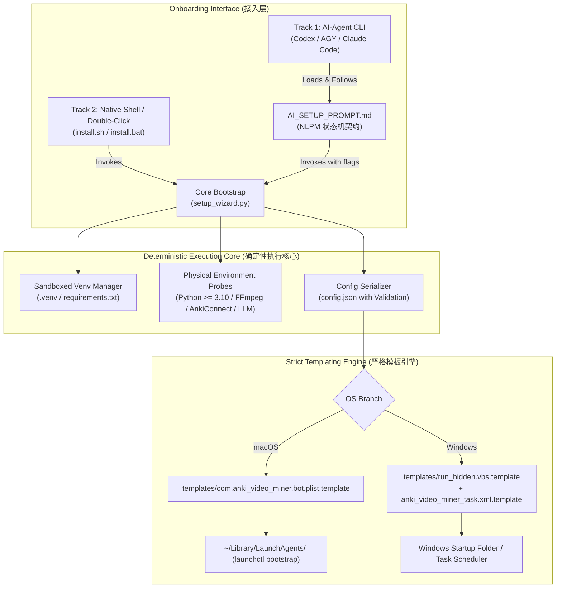

# ADR 0001: 跨平台部署与 AI 驱动交付架构决策 (Cross-Platform AI-Driven Deployment Architecture)

* **状态**: Accepted (已批准)
* **日期**: 2026-09-26
* **决策者**: CTO & 决策委员会 (Optimist, Cynical Auditor, Risk Officer, Synthesis Arbiter)
* **方法论锚定**: 李笑来《上来就要做真的工程》《MADR 架构决策记录》《大本营原则》《NLPM 自然语言编程》

---

## 1. 背景与问题陈述 (Context & Problem Statement)

`anki-video-miner` 是一套打通本地视频/音频下载、ASR 语音转录、LLM 智能挖掘与 Anki 深度学习卡片自动制卡的生产力系统。
为了让任何人在 GitHub 上一键克隆即可在自己的设备（macOS / Windows）上运行，并借助终端 AI Agent（Codex、Claude Code、AGY）实现“零摩擦全自动配置”，必须解决以下核心矛盾：

1. **环境依赖地狱**：Python 版本、虚拟环境沙盒化、FFmpeg 动态库与编解码依赖。
2. **操作系统守护机制断裂**：macOS 使用 `launchd` plist 体系；Windows 使用任务计划程序（Task Scheduler）或后台 VBS 隐形启动，两者的权限、路径、进程模型迥异。
3. **AI 幻觉与脆弱性**：若放任外部大模型“现场即兴编写系统服务或批处理”，在 Windows 执行策略（Execution Policy）、UAC 权限墙、字符编码（GBK vs UTF-8）下崩溃率高达 80%+。
4. **本质复杂度与附带复杂度的边界模糊**：哪些操作必须由人类物理介入？哪些操作必须彻底被代码/AI 静默消除？

---

## 2. 决策驱动力 (Decision Drivers)

* **大本营绝对纯净原则**：禁止全局污染 Python 环境，强制隔离至本地 `.venv`。配置收敛于单一单一可信源 `config.json`。
* **人机责任严格边界**：
  * **本质复杂度 (Essential Complexity - 人类必做)**：提供 API Key / Bot Token、开启 Anki 桌面端并安装 AnkiConnect 插件。
  * **附带复杂度 (Accidental Complexity - AI/系统包揽)**：虚拟环境创建、依赖树解析、系统路径探针检测、模板参数插值、系统服务挂载。
* **反脆弱与确定性 (Anti-Fragility & Determinism)**：禁止 AI 自由发挥编写系统守护脚本；使用经过严格 TDD 验证的静态配置模板（Strict Templating）进行确定性变量插值。
* **双轨可用性 (Dual-Track Usability)**：既满足极客用户“在终端由 AI Agent 自动部署”，又保证普通用户“双击或运行单条命令原生自举”。

---

## 3. 考虑的备选方案 (Considered Options)

* **方案 A：纯 AI Agent 即兴驱动 (Pure Agentic Freeform)**
  * 用户登录 Codex / AGY 后，将整个仓库交给 AI，让 AI 阅读 README 自行编写配置和守护脚本。
  * *劣势*：Windows Defender 极易拦截 AI 现场生成的临时批处理；AI 在不同操作系统上极易写出语法错误的 plist / xml 造成死循环拉起（Thrashing）。
* **方案 B：纯脚本死板硬编码向导 (Rigid CLI Wizard Only)**
  * 只提供一段固定不变的 Python 交互脚本，不提供 AI 交互协议。
  * *劣势*：无法利用用户已有的 Codex / AGY 终端智能排错能力；遇到系统特异性问题无法动态自愈。
* **方案 C：双轨确定性架构 (Dual-Track Deterministic Architecture - 中选方案)**
  * **轨 1**：提供由 NLPM 门禁审计的 `AI_SETUP_PROMPT.md`，赋能外部 AI Agent 作为严格的状态机执行者，禁止 AI 自创脚本，仅允许执行受控的参数收集与模板插值。
  * **轨 2**：提供原生零依赖的 `install.sh` / `install.bat` 与 `setup_wizard.py`，内置物理探针（AnkiConnect、Bot Token、FFmpeg），支持全自动与半自动执行。
  * **核心底座**：系统服务采用 `templates/` 模板静态插值，双端物理隔离。

---

## 4. 决策结果 (Decision Outcome)

选定 **方案 C (双轨确定性架构)**。

### 4.1 架构拓扑分层 (Architectural Layers)

### 4.2 人机责任边界矩阵 (Responsibility Boundary Matrix)

| 事项 | 复杂性属性 | 执行主体 | 物理验证与失败保护 |
| :--- | :--- | :--- | :--- |
| **提供 Telegram Bot Token** | 本质复杂度 | 人类 (@BotFather 获取) | 探针调用 `https://api.telegram.org/bot<TOKEN>/getMe` 校验，返回 200 则 PASS，否则阻断 |
| **提供 LLM 凭证** | 本质复杂度 | 人类 (或直接使用本机已登录的 Codex/AGY) | 调用 `llm_client.py` 探针发起 1 token ping 测试 |
| **开启 Anki 并安装 AnkiConnect** | 本质复杂度 | 人类 (安装代码 2055492159) | 探针探测 `http://127.0.0.1:8765` 请求 version，失败则阻断并给出图文指引 |
| **虚拟环境与依赖拉取** | 附带复杂度 | 系统脚本 / AI | 自动使用当前 Python 解释器 `venv .venv`，静默安装 `requirements.txt` |
| **系统路径与绝对变量** | 附带复杂度 | 系统脚本 / AI | 自动探测当前仓库存放绝对路径，消除硬编码 |
| **守护进程注册与开机自启** | 附带复杂度 | 系统脚本 / AI | 基于静态模板进行插值，生成用户级开机启动项，零管理员权限提权破坏 |

---

## 5. 积极效果 (Positive Consequences)

* **零幻觉系统破坏**：系统服务文件由预先验证的模板生成，杜绝 AI 乱改注册表、乱写 plist 导致的系统循环重启（Thrashing）。
* **全平台鲁棒性**：Windows 端采用隐形启动 VBS（彻底消除黑框 cmd 窗口弹出）与 UTF-8 代码页强制声明，避免中文乱码；macOS 采用标准用户级 `LaunchAgents`。
* **物理防呆门禁 (P0 Tripwires)**：在服务注册前必须 100% 跑通物理探针，禁止在连通性未就绪时盲目挂载后台死循环。

## 6. 消极后果与应对 (Negative Consequences & Mitigations)

* **局限**：Windows Defender 偶尔对未知 `.vbs` 脚本报毒。
  * *应对*：在 Windows 安装向导中提供纯 `.bat` 窗口运行与 `pythonw.exe` 两种备用挂载方式，若检测到 WScript 受阻则自动降级为桌面快捷方式。
* **局限**：跨平台 Anki 端口绑定差异（localhost vs 127.0.0.1）。
  * *应对*：在 `config_loader.py` 与探针中统一绑定 `127.0.0.1:8765`，并在请求头中附加 `Origin: http://127.0.0.1` 规避 CORS 拦截。
